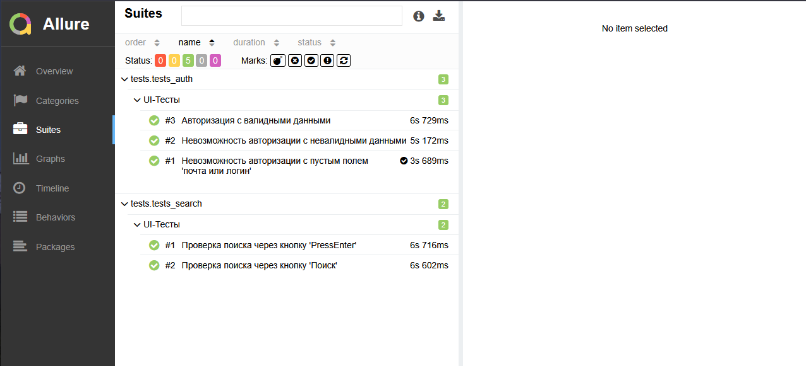
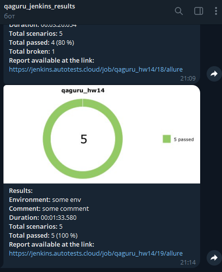

# Проект по тестированию сервиса электронных и аудиокниг "Литрес"

> [Ссылка на сайт](https://www.litres.ru)


### Список проверок, реализованных в автотестах:

### UI-тесты
- [x] Авторизация пользователя(успешная и неуспешная)
- [x] Поиск книги

----
### Проект реализован с использованием:
      

- Язык: `Python`
- Для написания UI-тестов используется фреймворк `Selene`, "обёртка" вокруг `Selenium WebDriver`
- Библиотека модульного тестирования: `PyTest`
- `Jenkins` выполняет удаленный запуск тестов.
- `Selenoid` запускает браузер с тестами в контейнерах `Docker` (и записывает видео)
- Фреймворк`Allure Report` собирает графический отчет о прохождении тестов
- После завершения тестов `Telegram Bot` отправляет в `Telegram` краткий вариант отчёта

----
### Локальный запуск
> Перед запуском в корне проекта создать файл .env с содержимым:
```
SELENOID_LOGIN=user1
SELENOID_PASS=1234
SELENOID_URL=selenoid.autotests.cloud

LITRES_LOGIN={email of your test litres account}
LITRES_PASSWORD={password of your test litres account}

```

> Для локального запуска необходимо выполнить (ключ выбора версии --browser-version не обязателен):
```
python -m venv .venv
source .venv/bin/activate
pip install -r requirements.txt
pytest -s . --browser_version=128.0
```

----
### Удаленный запуск автотестов выполняется на сервере Jenkins
> [Ссылка на проект в Jenkins](https://jenkins.autotests.cloud/job/qaguru_hw14/)

#### Параметры сборки

- `BROWSER_VERSION` - версия браузера (браузер `Chrome`)
- `COMMENT` - комментарий


#### Для запуска автотестов в Jenkins

1. Открыть [проект](https://jenkins.autotests.cloud/job/qaguru_hw14/)
2. Выбрать пункт `Build with Parameters`
3. Указать версию браузера
4. Указать комментарий
5. Нажать кнопку `Build`
6. Результат запуска сборки можно посмотреть в отчёте Allure

----
### Allure отчет


#### Общие результаты


#### Список тест кейсов и пример отчета о прохождении теста



----
### Оповещение о результатах прогона тестов в Telegram
> [Ссылка на канал в Telegram](https://t.me/qaguru_rybka_bot)


